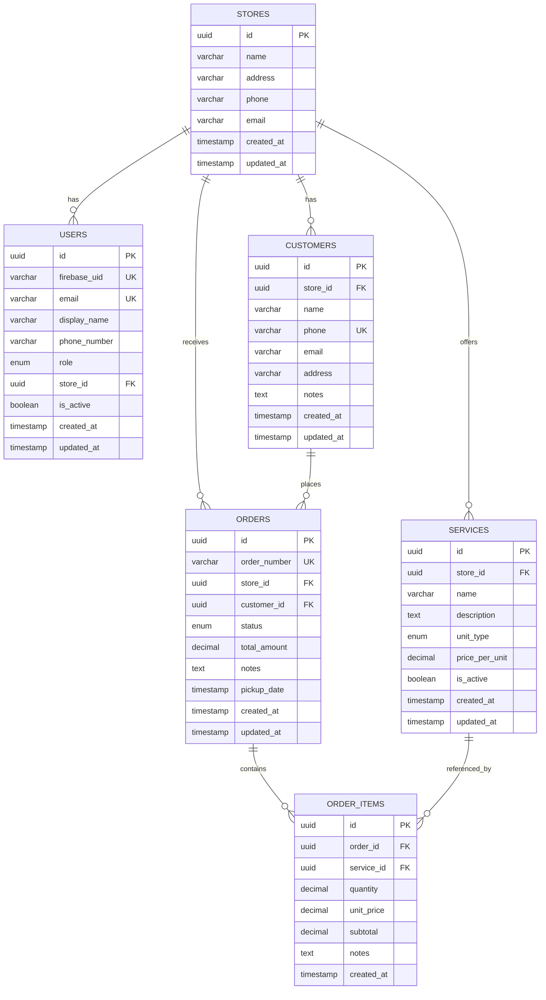

# 02 — Database Schema Blueprint

> **Document Status:** Definitive TypeORM entity reference. Every entity, column, enum, relation, and index is documented here.

---

## 1. Enums

### 1.1 `Role`

```typescript
export enum Role {
  ADMIN = 'ADMIN',
  STORE_OWNER = 'STORE_OWNER',
}
```

| Value | Description |
|---|---|
| `ADMIN` | System-wide administrator. Full access to all stores and data. |
| `STORE_OWNER` | Scoped to a single store. Manages their own customers, services, and orders. |

### 1.2 `OrderStatus`

```typescript
export enum OrderStatus {
  PENDING = 'PENDING',
  PROCESSING = 'PROCESSING',
  READY_FOR_PICKUP = 'READY_FOR_PICKUP',
  COMPLETED = 'COMPLETED',
  CANCELLED = 'CANCELLED',
}
```

| Value | Description |
|---|---|
| `PENDING` | Order created, awaiting processing. |
| `PROCESSING` | Items are being washed/cleaned. |
| `READY_FOR_PICKUP` | Items are cleaned and awaiting customer pickup. |
| `COMPLETED` | Customer has picked up items; order finalized. |
| `CANCELLED` | Order cancelled by store owner or customer. |

### 1.3 `UnitType`

```typescript
export enum UnitType {
  KG = 'KG',
  PIECE = 'PIECE',
  PAIR = 'PAIR',
}
```

| Value | Description |
|---|---|
| `KG` | Priced per kilogram (e.g., general laundry). |
| `PIECE` | Priced per individual item (e.g., shirt, dress). |
| `PAIR` | Priced per pair (e.g., shoes, socks). |

---

## 2. Entity Relationship Diagram



---

## 3. Table Definitions

### 3.1 `stores`

The root entity for multi-tenancy. Every tenant (laundry shop location) is a row in this table.

```typescript
@Entity('stores')
export class Store {
  @PrimaryGeneratedColumn('uuid')
  id: string;

  @Column({ type: 'varchar', length: 255 })
  name: string;

  @Column({ type: 'varchar', length: 500, nullable: true })
  address: string;

  @Column({ type: 'varchar', length: 20, nullable: true })
  phone: string;

  @Column({ type: 'varchar', length: 255, nullable: true })
  email: string;

  @CreateDateColumn({ name: 'created_at' })
  createdAt: Date;

  @UpdateDateColumn({ name: 'updated_at' })
  updatedAt: Date;

  // ─── Relations ────────────────────────────────────
  @OneToMany(() => User, (user) => user.store)
  users: User[];

  @OneToMany(() => Customer, (customer) => customer.store)
  customers: Customer[];

  @OneToMany(() => Service, (service) => service.store)
  services: Service[];

  @OneToMany(() => Order, (order) => order.store)
  orders: Order[];
}
```

**Indexes:** Primary key on `id`.

---

### 3.2 `users`

Application users authenticated via Firebase. Linked to a store for `STORE_OWNER` role.

```typescript
@Entity('users')
@Unique(['firebase_uid'])
@Unique(['email'])
export class User {
  @PrimaryGeneratedColumn('uuid')
  id: string;

  @Column({ type: 'varchar', length: 128, unique: true, name: 'firebase_uid' })
  firebaseUid: string;

  @Column({ type: 'varchar', length: 255, unique: true })
  email: string;

  @Column({ type: 'varchar', length: 255, name: 'display_name' })
  displayName: string;

  @Column({ type: 'varchar', length: 20, nullable: true, name: 'phone_number' })
  phoneNumber: string;

  @Column({ type: 'enum', enum: Role, default: Role.STORE_OWNER })
  role: Role;

  @Column({ type: 'uuid', nullable: true, name: 'store_id' })
  storeId: string;

  @Column({ type: 'boolean', default: true, name: 'is_active' })
  isActive: boolean;

  @CreateDateColumn({ name: 'created_at' })
  createdAt: Date;

  @UpdateDateColumn({ name: 'updated_at' })
  updatedAt: Date;

  // ─── Relations ────────────────────────────────────
  @ManyToOne(() => Store, (store) => store.users, { nullable: true, onDelete: 'SET NULL' })
  @JoinColumn({ name: 'store_id' })
  store: Store;
}
```

**Indexes:**
- Unique on `firebase_uid`
- Unique on `email`
- Index on `store_id`

**Business Rules:**
- `ADMIN` users have `store_id = NULL` (they operate across all stores).
- `STORE_OWNER` users **must** have a valid `store_id`.

---

### 3.3 `customers`

Customers of each laundry store. Scoped by `store_id` for multi-tenancy.

```typescript
@Entity('customers')
@Index(['store_id', 'phone'], { unique: true })
export class Customer {
  @PrimaryGeneratedColumn('uuid')
  id: string;

  @Column({ type: 'uuid', name: 'store_id' })
  storeId: string;

  @Column({ type: 'varchar', length: 255 })
  name: string;

  @Column({ type: 'varchar', length: 20 })
  phone: string;

  @Column({ type: 'varchar', length: 255, nullable: true })
  email: string;

  @Column({ type: 'varchar', length: 500, nullable: true })
  address: string;

  @Column({ type: 'text', nullable: true })
  notes: string;

  @CreateDateColumn({ name: 'created_at' })
  createdAt: Date;

  @UpdateDateColumn({ name: 'updated_at' })
  updatedAt: Date;

  // ─── Relations ────────────────────────────────────
  @ManyToOne(() => Store, (store) => store.customers, { onDelete: 'CASCADE' })
  @JoinColumn({ name: 'store_id' })
  store: Store;

  @OneToMany(() => Order, (order) => order.customer)
  orders: Order[];
}
```

**Indexes:**
- Composite unique on `(store_id, phone)` — a phone number must be unique **within** a store.
- Index on `store_id`.

---

### 3.4 `services`

The laundry service catalog (pricing matrix). Each store defines its own services.

```typescript
@Entity('services')
@Index(['store_id', 'name'], { unique: true })
export class Service {
  @PrimaryGeneratedColumn('uuid')
  id: string;

  @Column({ type: 'uuid', name: 'store_id' })
  storeId: string;

  @Column({ type: 'varchar', length: 255 })
  name: string;

  @Column({ type: 'text', nullable: true })
  description: string;

  @Column({ type: 'enum', enum: UnitType, name: 'unit_type' })
  unitType: UnitType;

  @Column({ type: 'decimal', precision: 10, scale: 2, name: 'price_per_unit' })
  pricePerUnit: number;

  @Column({ type: 'boolean', default: true, name: 'is_active' })
  isActive: boolean;

  @CreateDateColumn({ name: 'created_at' })
  createdAt: Date;

  @UpdateDateColumn({ name: 'updated_at' })
  updatedAt: Date;

  // ─── Relations ────────────────────────────────────
  @ManyToOne(() => Store, (store) => store.services, { onDelete: 'CASCADE' })
  @JoinColumn({ name: 'store_id' })
  store: Store;

  @OneToMany(() => OrderItem, (orderItem) => orderItem.service)
  orderItems: OrderItem[];
}
```

**Indexes:**
- Composite unique on `(store_id, name)` — service names unique per store.
- Index on `store_id`.

---

### 3.5 `orders`

Customer orders with status tracking and total amount calculation.

```typescript
@Entity('orders')
export class Order {
  @PrimaryGeneratedColumn('uuid')
  id: string;

  @Column({ type: 'varchar', length: 20, unique: true, name: 'order_number' })
  orderNumber: string;

  @Column({ type: 'uuid', name: 'store_id' })
  storeId: string;

  @Column({ type: 'uuid', name: 'customer_id' })
  customerId: string;

  @Column({ type: 'enum', enum: OrderStatus, default: OrderStatus.PENDING })
  status: OrderStatus;

  @Column({ type: 'decimal', precision: 12, scale: 2, default: 0, name: 'total_amount' })
  totalAmount: number;

  @Column({ type: 'text', nullable: true })
  notes: string;

  @Column({ type: 'timestamp', nullable: true, name: 'pickup_date' })
  pickupDate: Date;

  @CreateDateColumn({ name: 'created_at' })
  createdAt: Date;

  @UpdateDateColumn({ name: 'updated_at' })
  updatedAt: Date;

  // ─── Relations ────────────────────────────────────
  @ManyToOne(() => Store, (store) => store.orders, { onDelete: 'CASCADE' })
  @JoinColumn({ name: 'store_id' })
  store: Store;

  @ManyToOne(() => Customer, (customer) => customer.orders, { onDelete: 'CASCADE' })
  @JoinColumn({ name: 'customer_id' })
  customer: Customer;

  @OneToMany(() => OrderItem, (orderItem) => orderItem.order, { cascade: true })
  items: OrderItem[];
}
```

**Indexes:**
- Unique on `order_number`.
- Index on `store_id`.
- Index on `customer_id`.
- Index on `status`.
- Index on `created_at` (for date-range analytics queries).

**Order Number Format:** `ORD-{YYYYMMDD}-{sequential_4_digits}` — e.g., `ORD-20260318-0001`.

---

### 3.6 `order_items`

Line items within an order, referencing a service and capturing quantity/pricing at order time.

```typescript
@Entity('order_items')
export class OrderItem {
  @PrimaryGeneratedColumn('uuid')
  id: string;

  @Column({ type: 'uuid', name: 'order_id' })
  orderId: string;

  @Column({ type: 'uuid', name: 'service_id' })
  serviceId: string;

  @Column({ type: 'decimal', precision: 10, scale: 2 })
  quantity: number;

  @Column({ type: 'decimal', precision: 10, scale: 2, name: 'unit_price' })
  unitPrice: number;

  @Column({ type: 'decimal', precision: 12, scale: 2 })
  subtotal: number;

  @Column({ type: 'text', nullable: true })
  notes: string;

  @CreateDateColumn({ name: 'created_at' })
  createdAt: Date;

  // ─── Relations ────────────────────────────────────
  @ManyToOne(() => Order, (order) => order.items, { onDelete: 'CASCADE' })
  @JoinColumn({ name: 'order_id' })
  order: Order;

  @ManyToOne(() => Service, (service) => service.orderItems, { onDelete: 'RESTRICT' })
  @JoinColumn({ name: 'service_id' })
  service: Service;
}
```

**Indexes:**
- Index on `order_id`.
- Index on `service_id`.

**Business Rules:**
- `unit_price` is **snapshot** at order creation time from `services.price_per_unit`. This prevents price changes from retroactively affecting historical orders.
- `subtotal = quantity × unit_price` — calculated at creation time and stored.
- `orders.total_amount = SUM(order_items.subtotal)` — recalculated whenever items are added/removed.
- `onDelete: 'RESTRICT'` on `service` prevents deleting a service that has been used in orders. Services should be deactivated (`is_active = false`) instead.

---

## 4. Migration Strategy

| Environment | Strategy | Notes |
|---|---|---|
| **Development** | `synchronize: true` | TypeORM auto-syncs schema from entities. Convenient but **never** safe for production. |
| **Production** | TypeORM Migrations | Use `typeorm migration:generate` to create migration files. Run with `typeorm migration:run`. |

### Migration Commands

```bash
# Generate a migration after entity changes
pnpm --filter api typeorm migration:generate src/database/migrations/MigrationName

# Run pending migrations
pnpm --filter api typeorm migration:run

# Revert last migration
pnpm --filter api typeorm migration:revert
```

---

## 5. Seed Data (Development)

A seed script should create the following for local development:

| Entity | Seed Data |
|---|---|
| **Store** | 1 store: "Sparkle Clean Laundry" |
| **Admin User** | 1 admin user (firebase_uid will be populated on first login) |
| **Store Owner** | 1 store owner assigned to the seeded store |
| **Customers** | 5 sample customers for the store |
| **Services** | 5 services: "Wash & Fold (KG)", "Dry Clean (PIECE)", "Ironing (PIECE)", "Shoe Cleaning (PAIR)", "Bedding (PIECE)" |
| **Orders** | 10 sample orders with varying statuses across the past 30 days |

---

> **Previous:** [01_architecture_and_stack.md](./01_architecture_and_stack.md) | **Next:** [03_ui_ux_guidelines.md](./03_ui_ux_guidelines.md)
